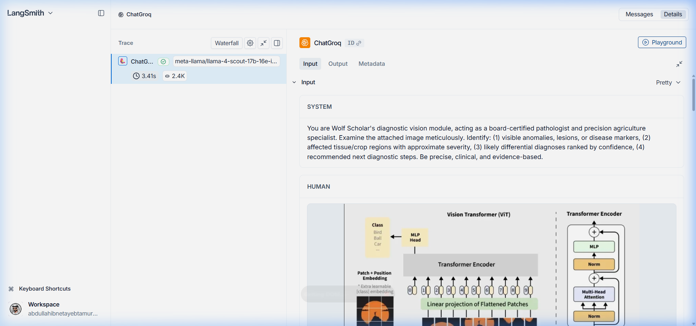

# Wolf Scholar: Multi-Modal Research Copilot 🐺

> **Engineered & Deployed by: Abdullah Ibne Tayeb Tamur**
> *CIS Lab Multi-Modal AI Research Architecture*

Wolf Scholar is an elite, multi-agent expert system built for my AI/ML course. Designed with a frictionless, Gemini-style user experience, it seamlessly integrates Web Search, Document Q&A (RAG via FAISS), and Vision/OCR capabilities utilizing Groq's high-speed Llama inference engine and Streamlit.

---

## ✨ UI/UX Innovations: The "Gemini" Experience

The platform has been completely overhauled to remove manual agent switching, replacing it with an **Intelligent Routing Engine** and a premium SaaS interface (Dark Theme `#111214`, 15px rounded containers, pinned input).

### 🧠 Unified Intelligent Routing
Users interact with a single, unified chat interface and a universal `➕ Attach File` button. The router dynamically evaluates the payload and triggers the correct LangChain agent:
* **📄 Document Upload (PDF/TXT)** → Automatically routes to the **FAISS Knowledge Base** for methodology analysis and RAG.
* **🖼️ Image Upload (PNG/JPG)** → Automatically routes to the **Vision/OCR Agent** for diagnostic image analysis.
* **🌐 Text-only Prompt** → Automatically routes to the **Academic Web Search Agent**.

### 🔍 Tool Transparency
Every agent action is fully transparent. Using `st.status` accordions, users see exactly what the AI is executing in the background in real-time (e.g., *"Wolf Scholar is reading the PDF via FAISS..."*) before the final response streams in.

---

## 🏗️ System Architecture

```text
Wolf-Scholar/
├── app/                # UI Layer (Streamlit Frontend, Unified Router)
├── agents/             # Logic Layer (Search, RAG, Vision)
├── utils/              # Infra Layer (LLM factory, DB utils)
├── database/           # Persistence Layer (SQLite history + FAISS index)
├── requirements.txt    # Dependency graph
└── .env.example        # Template for environment variables
```

### The Agent Matrix

| Agent | Core Capability | Inference Model (Groq API) |
| --- | --- | --- |
| 🌐 **Academic Search** | Real-time academic web search (DuckDuckGo) | `llama-3.3-70b-versatile` |
| 📚 **RAG Copilot** | Document Q&A via FAISS (k=3 retrieval) | `llama-3.3-70b-versatile` |
| 👁️ **Vision Diagnostics** | Multi-modal pathology & image understanding | `meta-llama/llama-4-scout-17b-16e-instruct` |

---

## 🚀 How to Run the Project Locally

### 1. Create and Activate the Virtual Environment

To keep dependencies isolated, create a virtual environment (`venv`):

**Windows:**

```bash
python -m venv venv
venv\Scripts\activate
```

**Mac/Linux:**

```bash
python3 -m venv venv
source venv/bin/activate
```

### 2. Install Dependencies

```bash
pip install -r requirements.txt
```

### 3. Required Files to Create (`.env`)

For security, API keys are **not included** in this repository. You must create a `.env` file in the root directory (reference `.env.example`). It must contain:

```env
GROQ_API_KEY=your_groq_api_key_here
LANGCHAIN_TRACING_V2=true
LANGCHAIN_ENDPOINT="https://api.smith.langchain.com"
LANGCHAIN_API_KEY=your_langsmith_api_key_here
LANGCHAIN_PROJECT="Wolf_Scholar"
```

### 4. Run the Application

```bash
streamlit run app/app_ui.py
```

---

## 🔗 LangSmith Tracing (Live Observability)

This project is fully integrated with **LangSmith** for real-time agent telemetry, tool tracking, and workflow inspection. To view your own traces, sign up at [smith.langchain.com](https://smith.langchain.com) and add your API key to the `.env` file.

### 📊 Evaluation Component 4.3: LangSmith Traces
To demonstrate the execution of the Wolf Scholar chatbot, workflow tracing has been fully implemented. Below are public, read-only links to specific agent executions showing tool usage and LLM reasoning:

* **Trace 1: RAG Document Analysis (FAISS)**
  * [Link to Trace](https://smith.langchain.com/public/5d965407-b967-42fe-b7ae-503a5e50de87/r)
  * *Description:* Demonstrates the agent chunking a PDF, embedding it, and retrieving context to answer an academic query.
* **Trace 2: Academic Web Search (DuckDuckGo)**
  * [Link to Trace](https://smith.langchain.com/public/fa90a965-c549-4b7b-be52-3a443a1953b5/r)
  * *Description:* Shows the agent deciding to use the DuckDuckGo search tool to pull live academic data.
* **Trace 3: Vision/OCR Diagnostics**
  * [Link to Trace](https://smith.langchain.com/public/8d2747e9-b31a-44a2-9935-ed380d363495/r)
  * *Description:* Displays the workflow of encoding an image and passing it to the Llama 4 Scout model for analysis.

**Visual Trace Execution:**


---

## 📺 Project Video Demonstration
For a full walkthrough of the Wolf Scholar platform, including the intelligent routing engine and multi-modal agent capabilities, please watch the video demo below:

[

* **Key Highlights:**
  * Interactive demonstration of Unified Routing.
  * Real-time RAG and Academic Search synthesis.
  * Vision/OCR diagnostic breakdown.

---

## 📝 Remaining Problems & Discussion Points

1. **Vector Database Deployment:** I implemented FAISS for local document retrieval to avoid the `sqlite-vec` Streamlit Cloud compilation crashes. I used standard SQLite for relational chat history. Is this hybrid DB approach acceptable for the final grading rubric?
2. **Model Deprecation Handling:** The originally planned `llama-3.2-11b-vision-preview` was decommissioned by Groq. I seamlessly migrated the OCR agent to `meta-llama/llama-4-scout-17b-16e-instruct` to maintain vision capabilities.
3. **API Rate Limiting:** We need to discuss token management best practices (e.g., limiting FAISS retrieval to `k=3` chunks) to prevent hitting the `429 RESOURCE_EXHAUSTED` Groq limit during intensive RAG testing.

---

*Developed for AI/ML Final Project Submission.* 🐺✨
